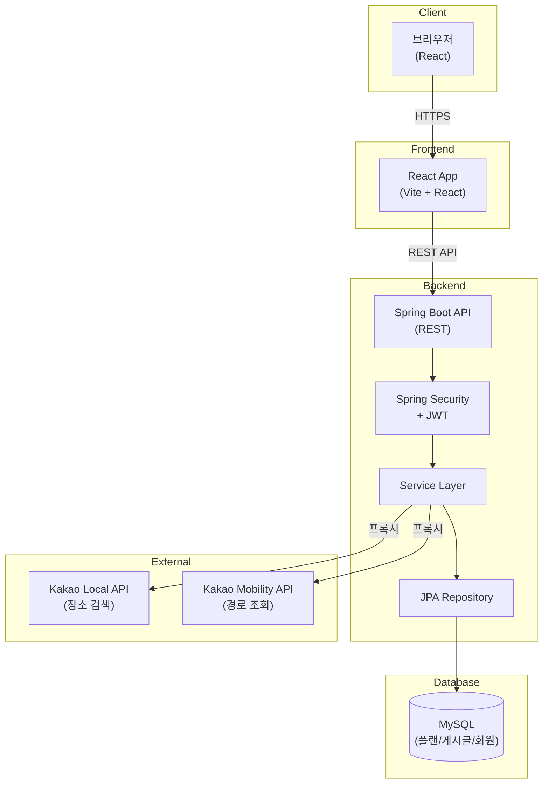

# 컬처맵 (CultureMap) 🗺️

> **문화 일정을 계획하고, 기록하고, 공유하는 커뮤니티 플랫폼**

---

## 🎬 데모

- **프로덕션**: https://culturemap.fly.dev
- **API 문서**: https://culturemap-api.fly.dev/swagger-ui.html

---

## 🎯 문제 정의 & 목표

### 문제
문화시설 정보가 분산되어 있고, 개인 플랜을 체계적으로 관리하고 공유할 수 있는 플랫폼이 부족함.

### 목표
- 사용자가 직접 문화시설을 조합해 날짜별 플랜 생성
- 플랜을 커뮤니티에 공유하여 좋은 문화 경험 확산
- 협업 기능으로 친구/가족과 함께 플랜 관리

---

## ✨ 주요 기능

1. **플랜 관리**: 날짜별 문화 플랜 생성/수정/삭제, 장소 추가
2. **플랜 협업**: 멤버 초대 (OWNER/EDITOR/VIEWER 권한)
3. **플랜 공유**: 개인 플랜을 게시글로 공유
4. **커뮤니티**: 공유 게시판 열람, 댓글 및 별점 평가
5. **장소 검색**: Kakao Local API 기반 주변 문화시설 검색 (디바운스, 캐싱)
6. **경로 조회**: Kakao Mobility API 기반 자동차 경로 표시
7. **관리자 대시보드**: 시스템 통계 및 API 사용량 모니터링

---

## 💻 기술 스택

### Backend
- **Framework**: Spring Boot 4.0.0
- **Language**: Java 17
- **ORM**: Spring Data JPA + Hibernate
- **Security**: Spring Security + JWT (Access/Refresh Token)
- **Build**: Gradle
- **DB**: MySQL 8.0 (운영), H2 (테스트)
- **API Docs**: springdoc-openapi + Swagger UI

### Frontend
- **Framework**: React 19.2.0 + TypeScript 5.9.3
- **Build**: Vite 7.2.4
- **Styling**: Tailwind CSS 3.4.0
- **Routing**: React Router DOM 6.26.0
- **HTTP**: Axios 1.7.7
- **Map**: react-kakao-maps-sdk 1.1.7

### Infra/Deploy
- **Container**: Docker + Docker Compose
- **CI/CD**: GitHub Actions (자동 배포)
- **Cloud**: Fly.io
- **Database**: MySQL (Aiven 또는 Fly.io 환경변수)

### External APIs
- Kakao Local API (문화시설 검색)
- Kakao Mobility Directions API (경로 조회)

---

## 🏗️ 시스템 구성도



### 아키텍처
- **3-Layer Architecture**: Controller → Service → Repository
- **JWT 기반 Stateless 인증**: Access Token (24h) + Refresh Token (7일)
- **외부 API 프록시**: 백엔드를 통한 API 키 보호 및 레이트 리밋

---

## 🚀 빠른 시작

### 요구사항
- Java 17+
- Node.js 18+
- Docker & Docker Compose (선택)
- MySQL 8.0 (또는 Docker Compose 사용)

### 로컬 실행

#### 1. 저장소 클론
```bash
git clone <repository-url>
cd CultureMap
```

#### 2. 백엔드 실행
```bash
# Windows
.\gradlew bootRun

# Linux/Mac
./gradlew bootRun
```
백엔드: `http://localhost:8080`

> 만약 `8080` 포트가 이미 사용 중이면, 다른 포트로 실행하세요.
>
> - **Windows (PowerShell)**: `$env:PORT=8081; .\gradlew bootRun`
> - **Windows (CMD)**: `set PORT=8081 && .\gradlew bootRun`
> - **IntelliJ**: VM options에 `-Dserver.port=8081` 추가

#### 3. 프론트엔드 실행
```bash
cd frontend
npm install
npm run dev
```
프론트엔드: `http://localhost:5173`

#### 4. API 문서
- Swagger UI: `http://localhost:8080/swagger-ui.html`

### Docker 실행

#### 전체 실행 (프로덕션 모드)
```bash
docker-compose -f docker/docker-compose.yml up -d --build
```

#### 개발 모드 (Hot Reload)
```bash
docker-compose -f docker/docker-compose.dev.yml up -d --build
```

#### 서비스 관리
```bash
# 중지
docker-compose -f docker/docker-compose.yml stop

# 중지 및 컨테이너 제거
docker-compose -f docker/docker-compose.yml down

# 로그 확인
docker-compose -f docker/docker-compose.yml logs -f
```

### 테스트
```bash
# 백엔드 테스트
.\gradlew test

# 프론트엔드 린트
cd frontend
npm run lint
```

---

## ⚙️ 환경변수

### Backend (.env 또는 환경변수)

| 변수명 | 설명 | 예시 형식 |
|--------|------|-----------|
| `DB_URL` | MySQL 연결 URL | `jdbc:mysql://localhost:3306/culturemap?useSSL=false&serverTimezone=Asia/Seoul` |
| `DB_USERNAME` | DB 사용자명 | `root` |
| `DB_PASSWORD` | DB 비밀번호 | `your-password` |
| `JWT_SECRET` | JWT 서명 키 (최소 32자) | `your-secret-key-min-32-chars` |
| `JWT_EXPIRATION` | Access Token 만료 시간 (ms) | `86400000` (24시간) |
| `KAKAO_REST_API_KEY` | Kakao REST API 키 | `your-kakao-rest-api-key` |
| `CORS_ALLOWED_ORIGINS` | 허용 Origin (쉼표 구분) | `http://localhost:5173,https://culturemap.fly.dev` |

### Frontend (빌드 시 주입)

| 변수명 | 설명 | 예시 형식 |
|--------|------|-----------|
| `VITE_API_BASE_URL` | 백엔드 API 기본 URL | `http://localhost:8080/api` |
| `VITE_KAKAO_MAP_API_KEY` | Kakao JavaScript 키 | `your-kakao-javascript-key` |

**참고**: 프론트엔드는 빌드 타임에 환경변수가 번들에 포함되므로, `.env.production` 파일 생성 또는 `--build-arg`로 전달 필요.

---

## 📁 폴더 구조

```
CultureMap/
├── src/main/java/com/culturemap/
│   ├── controller/          # REST API 컨트롤러
│   ├── service/             # 비즈니스 로직
│   ├── repository/          # JPA 리포지토리
│   ├── domain/              # 엔티티 (Member, Plan, Place 등)
│   ├── dto/                 # 데이터 전송 객체
│   ├── security/            # JWT 인증
│   └── config/              # 설정 (Security, Swagger 등)
├── frontend/
│   ├── src/
│   │   ├── components/      # React 컴포넌트
│   │   ├── pages/           # 페이지 컴포넌트
│   │   ├── services/        # API 서비스
│   │   ├── hooks/           # 커스텀 훅
│   │   └── types/           # TypeScript 타입
│   └── public/              # 정적 파일
├── docker/                  # Docker 설정
├── database/                # DB 초기화 스크립트
└── .github/workflows/       # CI/CD 파이프라인
```

---

## 🔧 트러블슈팅 & 의사결정

### 1. JPA N+1 문제 해결
**이슈**: 플랜 조회 시 연관된 장소/멤버를 매번 추가 쿼리로 조회  
**해결**: `@EntityGraph`와 `fetch join`을 활용한 단일 쿼리로 최적화

### 2. 검색 성능 최적화
**이슈**: Kakao Local API 호출 비용 및 응답 지연  
**해결**: 인메모리 캐싱 (10분 TTL) + 디바운스 (500ms) + 레이트 리밋 (1분당 30회)

### 3. 프론트엔드 환경변수 주입
**이슈**: Vite는 빌드 타임에 환경변수를 번들에 포함, Fly.io Secrets는 런타임만 지원  
**해결**: Docker 빌드 시 `--build-arg`로 전달 또는 `.env.production` 파일 사용

---

## 📄 라이선스

교육 목적으로 제작된 프로젝트입니다.

---

## TODO / 향후 개선 사항

- 검색/장소 데이터 캐시를 Redis 등 외부 캐시로 분리하여 멀티 인스턴스 환경에서 일관성 확보
- 플랜/게시글 조회 성능을 위한 페이징, 정렬, 인덱스 설계 고도화
- 관리자 대시보드 지표 확장(에러율, 응답시간, 외부 API 호출량/비용)
- E2E 테스트(Playwright 등) 및 API 계약 테스트 도입
- 접근성(A11y) 개선 및 모바일 UI/UX 개선
